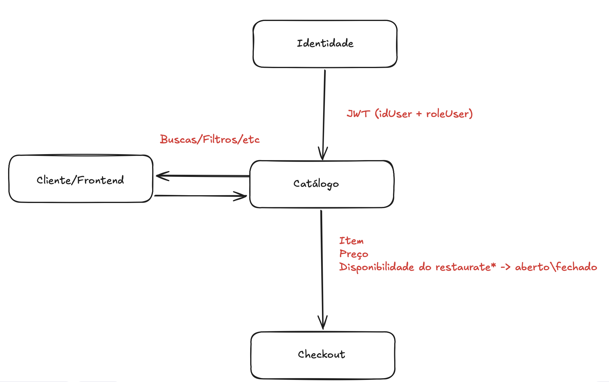

## Equipe

- Pedro Vinicius
- Marcus Vinicius
- Lucas Cassiano
- João Faria

Os serviços possuem três responsabilidades principais:

* **Restaurantes:** gerenciamento dos dados, status e horários de funcionamento dos restaurantes.
* **Cardápio:** gerenciamento dos itens, preços, categorias e disponibilidade.
* **Busca:** pesquisa e filtragem de restaurantes e itens do cardápio.

---

# Requisitos Funcionais

| **ID** | **Requisito**                              | **Descrição**                                                                                                                                                            |
| ------ | ------------------------------------------ | ------------------------------------------------------------------------------------------------------------------------------------------------------------------------ |
| RF01   | Cadastro de restaurantes                   | O sistema deve permitir cadastrar restaurantes com suas informações básicas, como nome, endereço, telefone e descrição, associando o restaurante ao usuário responsável. |
| RF02   | Consulta de restaurantes                   | O sistema deve permitir consultar as informações de um restaurante.                                                                                                      |
| RF03   | Atualização de restaurantes                | O sistema deve permitir ao proprietário alterar as informações cadastradas de seu restaurante.                                                                           |
| RF04   | Gerenciamento do status do restaurante     | O sistema deve permitir alterar e consultar o status de funcionamento de um restaurante.                                                                                 |
| RF05   | Gerenciamento de horários                  | O sistema deve permitir cadastrar, consultar e atualizar os horários de funcionamento de um restaurante.                                                                 |
| RF06   | Cadastro de itens do cardápio              | O sistema deve permitir cadastrar itens vinculados a um restaurante, contendo informações como nome, descrição, preço e disponibilidade.                                 |
| RF07   | Consulta de itens do cardápio              | O sistema deve permitir consultar e listar os itens disponíveis no cardápio de um restaurante.                                                                           |
| RF08   | Atualização de itens do cardápio           | O sistema deve permitir ao proprietário alterar as informações de um item do cardápio de seu restaurante.                                                                |
| RF09   | Gerenciamento da disponibilidade dos itens | O sistema deve permitir alterar e consultar a disponibilidade de um item do cardápio.                                                                                    |
| RF10   | Gerenciamento de categorias                | O sistema deve permitir cadastrar, consultar e associar categorias aos itens do cardápio.                                                                                |
| RF11   | Busca de restaurantes                      | O sistema deve permitir realizar buscas por restaurantes utilizando critérios de pesquisa.                                                                               |
| RF12   | Busca de itens                             | O sistema deve permitir realizar buscas por itens do cardápio.                                                                                                           |
| RF13   | Filtragem do catálogo                      | O sistema deve permitir filtrar restaurantes e itens utilizando critérios como categoria, status, disponibilidade e faixa de preço.                                      |
| RF14   | Consulta de cardápio por restaurante       | O sistema deve permitir consultar o cardápio completo associado a determinado restaurante.                                                                               |
| RF15   | Disponibilização dos dados do catálogo     | O sistema deve disponibilizar os dados de restaurantes, cardápios e itens por meio de APIs para os demais serviços da plataforma.                                        |
| RF16   | Validação de propriedade                   | O sistema deve verificar se o usuário autenticado é proprietário do restaurante antes de permitir operações de gerenciamento sobre o restaurante ou seu cardápio.        |
| RF17   | Validação de itens para Checkout           | O sistema deve permitir que o Checkout consulte informações atualizadas de itens, incluindo preço e disponibilidade.                                                     |
| RF18   | Validação de restaurante para Checkout     | O sistema deve permitir que o Checkout consulte o status e os horários de funcionamento de um restaurante.                                                               |

---

# Requisitos Não Funcionais

| **ID** | **Requisito**         | **Descrição**                                                                                                                     |
| ------ | --------------------- | --------------------------------------------------------------------------------------------------------------------------------- |
| RNF01  | Desempenho            | O sistema deve responder às requisições da API em tempo adequado, considerando as operações normalmente realizadas no catálogo.   |
| RNF02  | Disponibilidade       | O serviço deve permanecer disponível durante o funcionamento da plataforma, salvo situações de manutenção ou falhas externas.     |
| RNF03  | Segurança             | O acesso às operações de gerenciamento deve ser protegido por mecanismos de autenticação e autorização.                           |
| RNF04  | Usabilidade           | As APIs devem possuir respostas claras e padronizadas, facilitando seu entendimento e utilização.                                 |
| RNF05  | Manutenibilidade      | O código deve ser organizado de forma que alterações e correções possam ser realizadas sem comprometer as demais funcionalidades. |
| RNF06  | Integridade dos dados | O sistema deve garantir que os dados armazenados sejam válidos e consistentes.                                                    |

---

# Requisitos de Integração

| **ID** | **Requisito**                   | **Descrição**                                                                                                                                                  |
| ------ | ------------------------------- | -------------------------------------------------------------------------------------------------------------------------------------------------------------- |
| RI01   | Padronização dos endpoints      | Os endpoints devem seguir um padrão de nomenclatura e estrutura definido pela equipe.                                                                          |
| RI02   | Padronização dos erros          | As APIs devem retornar erros utilizando o formato e os códigos HTTP definidos pela plataforma.                                                                 |
| RI03   | Comunicação via API             | O sistema deve disponibilizar APIs HTTP/REST para comunicação com os demais microsserviços.                                                                    |
| RI04   | Documentação da API             | Os endpoints devem ser documentados utilizando Swagger/OpenAPI.                                                                                                |
| RI05   | Tratamento de indisponibilidade | O serviço deve tratar falhas de comunicação com outros serviços e retornar respostas adequadas.                                                                |
| RI06   | Integração com Identidade       | O serviço deve utilizar as informações de identidade disponibilizadas pelo mecanismo de autenticação para identificar o usuário responsável pelas requisições. |
| RI07   | Integração com Checkout         | O serviço deve fornecer ao Checkout informações atualizadas sobre restaurantes, itens, preços e disponibilidade.                                               |

---

# Fronteiras do Microsserviço

O Catálogo é responsável exclusivamente pelas informações pertencentes ao domínio de restaurantes e cardápios.

Informações relacionadas à autenticação e às permissões gerais dos usuários pertencem ao serviço de **Identidade**, enquanto carrinho, subtotal, promoções e pedidos pertencem ao serviço de **Checkout**.

O Catálogo mantém apenas a referência necessária para relacionar um restaurante ao seu proprietário, utilizando o identificador do usuário fornecido pelo mecanismo de autenticação.

## Entradas e Saídas

| **Entra no Catálogo**                   | **Vem de**            | **Uso no Catálogo**                                                          | **Sai do Catálogo**                       | **Vai para**     |
| --------------------------------------- | --------------------- | ---------------------------------------------------------------------------- | ----------------------------------------- | ---------------- |
| JWT (`sub`, `role`)                     | Identidade            | Identificar o usuário e verificar suas permissões gerais                     | Autorização da operação ou erro de acesso | Cliente/Frontend |
| Dados para criação de restaurante       | Cliente/Frontend      | Criar restaurante e associar o `ownerUserId` ao `sub` do usuário autenticado | Restaurante criado                        | Cliente/Frontend |
| Dados para atualização do restaurante   | Proprietário/Frontend | Verificar `JWT.sub == ownerUserId` e atualizar os dados                      | Restaurante atualizado                    | Cliente/Frontend |
| Dados de horário e status               | Proprietário/Frontend | Gerenciar o funcionamento do restaurante                                     | Horário/status atualizado                 | Cliente/Frontend |
| Dados de itens do cardápio              | Proprietário/Frontend | Criar ou atualizar itens pertencentes ao restaurante                         | Item criado/atualizado                    | Cliente/Frontend |
| Solicitação de listagem de restaurantes | Cliente/Frontend      | Buscar restaurantes disponíveis                                              | Lista de restaurantes                     | Cliente/Frontend |
| Termos e filtros de busca               | Cliente/Frontend      | Filtrar por nome, categoria, status, disponibilidade ou preço                | Resultados filtrados                      | Cliente/Frontend |
| Solicitação de cardápio                 | Cliente/Frontend      | Consultar o cardápio de determinado restaurante                              | Itens, preços e disponibilidade           | Cliente/Frontend |
| IDs dos itens selecionados              | Checkout              | Consultar e validar informações atuais dos itens                             | Itens, preços e disponibilidade           | Checkout         |
| ID do restaurante                       | Checkout              | Consultar status e horário de funcionamento                                  | Status e informações de funcionamento     | Checkout         |

---

# Propriedade dos Restaurantes

O serviço de Identidade é responsável por identificar o usuário, enquanto o Catálogo é responsável por determinar quais restaurantes pertencem a esse usuário.

Ao criar um restaurante, o identificador presente no campo `sub` do JWT é associado ao restaurante como `ownerUserId`.

Exemplo de informações obtidas a partir do JWT:

```json
{
  "sub": 57,
  "role": "USER"
}
```

Exemplo simplificado de restaurante armazenado pelo Catálogo:

```json
{
  "id": 10,
  "name": "Pizzaria do João",
  "ownerUserId": 57,
  "status": "OPEN"
}
```

Para operações de gerenciamento, o Catálogo compara a identidade do usuário autenticado com o proprietário do restaurante:

```text
JWT.sub == Restaurant.ownerUserId
```

Caso os identificadores sejam iguais, o usuário pode realizar as operações permitidas sobre aquele restaurante. Caso contrário, a operação deve ser rejeitada.

Dessa forma, o serviço de Identidade não precisa conhecer os restaurantes existentes e o Catálogo não precisa armazenar os dados completos dos usuários.

---

# Integração com Checkout

O Catálogo funciona como a **fonte de verdade** para informações relacionadas aos restaurantes e seus cardápios.

Quando um cliente seleciona itens para realizar uma compra, o Checkout pode enviar ao Catálogo os identificadores dos itens selecionados:

```json
{
  "restaurantId": 10,
  "items": [
    {
      "itemId": 101,
      "quantity": 2
    },
    {
      "itemId": 102,
      "quantity": 1
    }
  ]
}
```

O Catálogo é responsável por fornecer informações atualizadas sobre esses itens, como:

* existência do item;
* preço atual;
* disponibilidade;
* restaurante ao qual pertence;
* status e horário de funcionamento do restaurante.

O cálculo do subtotal, aplicação de promoções e criação do pedido permanecem sob responsabilidade do **Microsserviço de Checkout**.

## Fluxo Simplificado

<p align="center">
  
</p>

---

# Fora do Escopo

Não são responsabilidades do Microsserviço de Catálogo:

* autenticação de usuários;
* armazenamento de credenciais;
* gerenciamento global de usuários e permissões;
* gerenciamento do carrinho;
* cálculo do subtotal do pedido;
* aplicação de cupons e promoções;
* criação e gerenciamento de pedidos;
* processamento de pagamentos;
* cálculo de frete;
* gerenciamento de entregadores;
* rastreamento de entregas;
* notificações;
* avaliações.

Essas funcionalidades pertencem aos demais microsserviços da plataforma.
